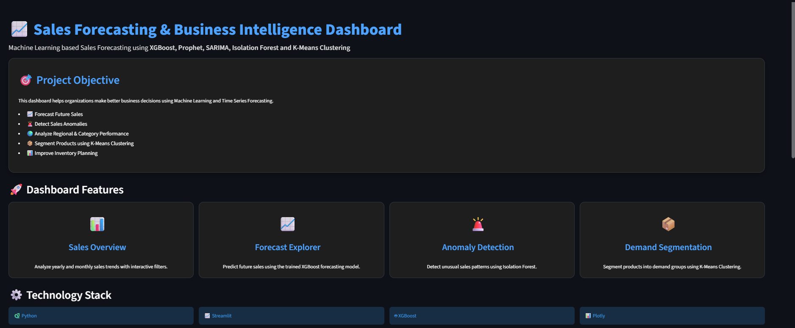
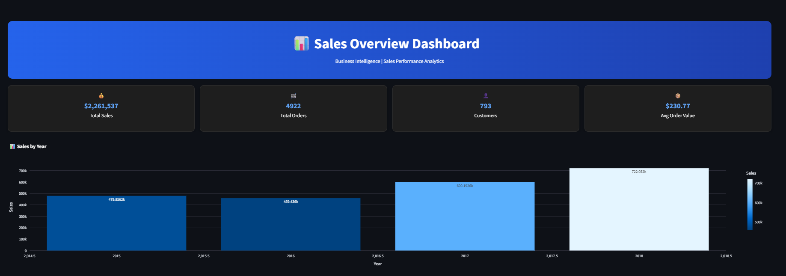
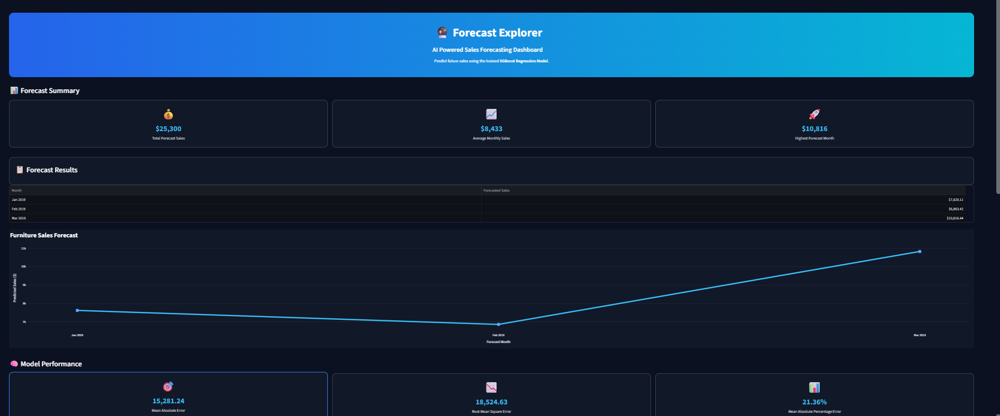
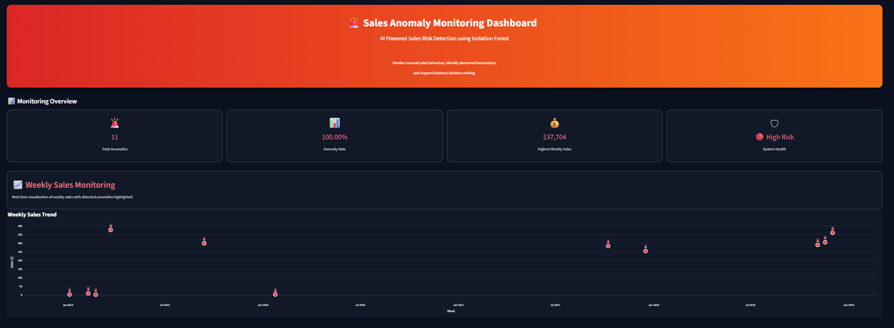
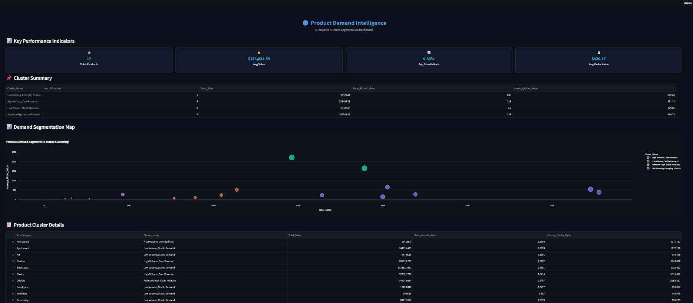

# 📈 Sales Forecasting Dashboard using Machine Learning


---

# 📌 Project Overview

This project is an end-to-end Machine Learning Sales Forecasting Dashboard built using **Python**, **Streamlit**, and multiple Machine Learning techniques.

The dashboard enables businesses to:

- 📊 Analyze historical sales performance
- 📈 Forecast future sales
- 🚨 Detect unusual sales anomalies
- 📦 Segment products based on demand
- 📉 Support inventory and business decision-making

---

# 🚀 Dashboard Features

## 📊 Sales Overview

- Total Sales KPI
- Monthly Sales Trend
- Sales by Region
- Sales by Category
- Interactive Filters

---

## 🔮 Forecast Explorer

- XGBoost Sales Forecast
- Forecast Horizon (1–3 Months)
- Interactive Line Chart
- Model Performance (MAE, RMSE, MAPE)

---

## 🚨 Anomaly Detection

- Isolation Forest
- Weekly Sales Monitoring
- AI Business Insights
- Executive Summary

---

## 📦 Product Demand Segmentation

- K-Means Clustering
- PCA Visualization
- Product Clusters
- Stocking Recommendations

---

# 🖼 Dashboard Screenshots

## Home Page



---

## Sales Overview



---

## Forecast Explorer



---

## Anomaly Report



---

## Product Demand Segments



---

# 🤖 Machine Learning Models Used

| Model | Purpose |
|---------|---------|
| XGBoost | Sales Forecasting |
| Prophet | Time Series Forecasting |
| SARIMA | Forecast Comparison |
| Isolation Forest | Anomaly Detection |
| K-Means | Product Segmentation |
| PCA | Cluster Visualization |

---

# 📂 Dataset

Dataset Source:

https://www.kaggle.com/datasets/rohitsahoo/sales-forecasting

Dataset contains:

- Orders
- Customers
- Products
- Categories
- Regions
- Sales
- Profit
- Quantity

---

# 📈 Project Workflow

```
Raw Sales Data
        │
        ▼
Data Cleaning
        │
        ▼
Exploratory Data Analysis
        │
        ▼
Feature Engineering
        │
        ▼
Forecasting Models
        │
        ▼
Anomaly Detection
        │
        ▼
K-Means Clustering
        │
        ▼
Interactive Streamlit Dashboard
```

---

# 📊 Model Performance

| Metric | Value |
|---------|-------|
| MAE | 15,281.24 |
| RMSE | 18,524.63 |
| MAPE | 21.36% |

---

# 💻 Technologies Used

- Python
- Streamlit
- Pandas
- NumPy
- Plotly
- Scikit-Learn
- XGBoost
- Prophet
- Statsmodels
- Joblib

---

# 📂 Project Structure

```
Sales_Forecasting_Project/

│
├── Home.py
│
├── train.csv
├── weekly_sales_anomalies.csv
├── clustering_results.csv
│
├── models/
│     ├── xgb_model.pkl
│     ├── model_metrics.pkl
│
├── pages/
│     ├── 1_📊_Sales_Overview.py
│     ├── 2_📈_Forecast_Explorer.py
│     ├── 3_🚨_Anomaly_Report.py
│     ├── 4_📦_Demand_Segments.py
│
├── requirements.txt
├── README.md
```

---

# ⚙ Installation

Clone Repository

```bash
git clone https://github.com/YourUsername/Sales-Forecasting-Dashboard.git
```

Go to Project Folder

```bash
cd Sales-Forecasting-Dashboard
```

Install Packages

```bash
pip install -r requirements.txt
```

Run Streamlit

```bash
streamlit run Home.py
```

---

# 🌐 Live Demo

Streamlit Cloud:

```
Deployment in progress...
```

---

# 🎯 Business Value

This dashboard helps organizations:

- Improve Inventory Planning
- Forecast Future Demand
- Detect Sales Risks
- Monitor Business Performance
- Support Data-Driven Decisions

---

# 🔮 Future Improvements

- Real-time Forecasting
- Database Integration
- User Authentication
- Cloud Deployment
- Automated Retraining
- Power BI Integration

---

# 👩‍💻 Author

**Vaishnavi Labhasetwar**

Data Analyst | Machine Learning Enthusiast

GitHub:
https://github.com/vaishnavilabhasetwar

LinkedIn:
https://linkedin.com/in/vaishnavilabhasetwar

---